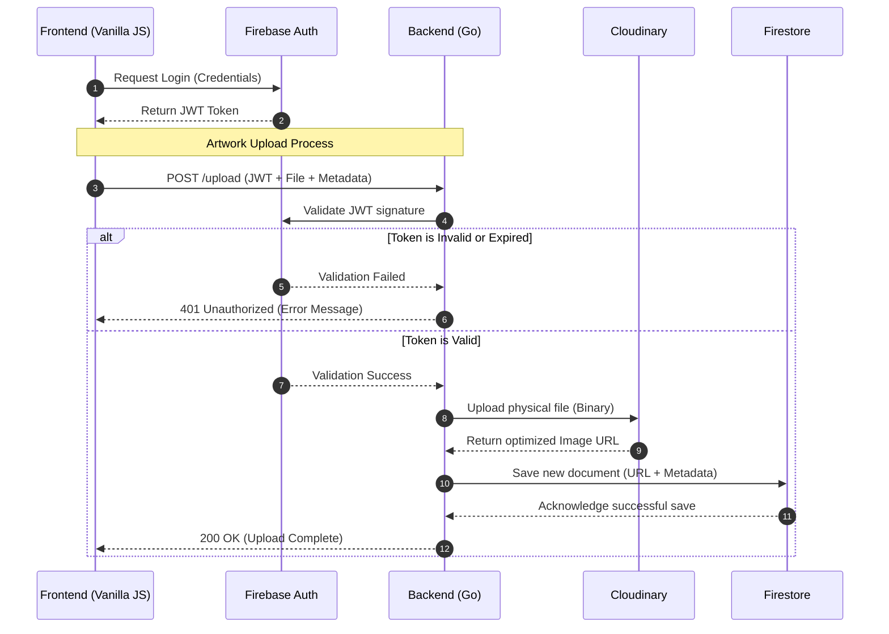

# Sequence Diagram
This diagram shows how and in wich order the diferents components of the system interacts between them when a new piece of art is uploaded through the admin panel.

- **Authentication:** Validating the client's JWT via Firebase Auth.
- **Error Handling:** Fallback logic returning a `401 Unauthorized` if the token is invalid or expired.
- **Media Processing:** Uploading the physical binary file to Cloudinary to get an optimized URL.
- **Data Persistence:** Saving the final document (Metadata + Image URL) into Firestore.